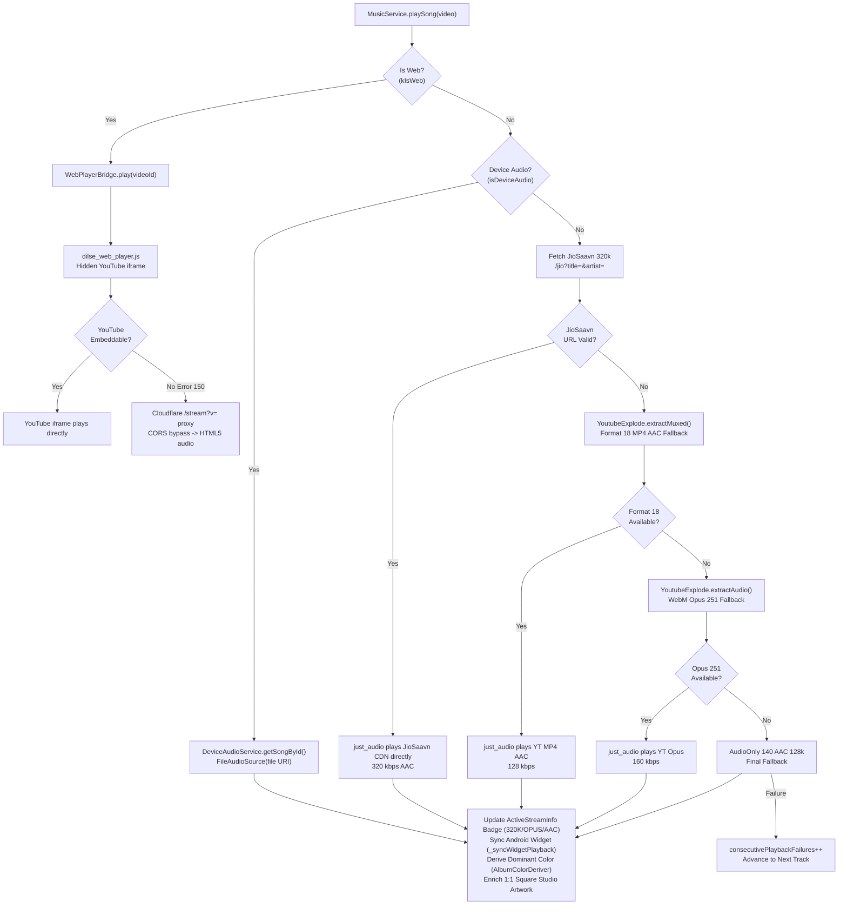

# DilSe Music — Complete Architectural Specification & X-Ray Documentation

**Version:** `3.8.0+22`  
**Branch:** `main` (Verified against commit `e95af07`)  
**Stack:** Flutter / Dart, Android (Kotlin), Web / PWA, Cloudflare Edge Worker, Render.com (Fallback)  
**License:** MIT  
**Author:** Charan Teja Kondakalla  

---

## Table of Contents
1. [Project Identity & Mission](#1-project-identity--mission)
2. [High-Level Architecture](#2-high-level-architecture)
3. [Backend Infrastructure](#3-backend-infrastructure)
4. [Audio Stream Cascade (How a Song Plays)](#4-audio-stream-cascade-how-a-song-plays)
5. [Service Layer — Deep Dive](#5-service-layer--deep-dive)
6. [Screen & UI Layer](#6-screen--ui-layer)
7. [Widget System](#7-widget-system)
8. [Recommendation Engine & Daily Mix](#8-recommendation-engine--daily-mix)
9. [Data Persistence & Offline Strategy](#9-data-persistence--offline-strategy)
10. [Android Widget Bridge](#10-android-widget-bridge)
11. [Web & PWA Architecture](#11-web--pwa-architecture)
12. [Test Architecture & Quality Gate](#12-test-architecture--quality-gate)
13. [Complete Commit Timeline](#13-complete-commit-timeline)
14. [Version Release History](#14-version-release-history)
15. [Dependency Map](#15-dependency-map)
16. [Architectural Constraints & Guardrails](#16-architectural-constraints--guardrails)

---

## 1. Project Identity & Mission

DilSe (Hindi: *"From the Heart"*) is a 100% free, open-source (MIT) music streaming application for Android and Web/PWA. Its core mission is to deliver the highest quality audio streaming experience with **zero server-side audio bandwidth cost**, **zero telemetry**, and **absolute offline capability**.

### Core Tenets

| Tenet | Implementation |
| :--- | :--- |
| **Zero Server-Side Audio Proxying** | All audio decoded client-side from official CDNs (JioSaavn, YouTube CDN). Cloudflare Worker only acts as CORS rewriter for web fallback. |
| **100% Free & Open-Source (MIT)** | Zero paywalled APIs, zero subscription requirements. |
| **Zero Telemetry / Tracking** | No Google Analytics, Firebase, Sentry Cloud, Crashlytics, or 3rd-party trackers. SentryLens is sovereign, on-device only. |
| **Full Offline Capability** | `shared_preferences`, local document directory audio files, `DeviceAudioService` local scanner. |
| **Fail-Safe Stream Cascade** | JioSaavn 320k $\to$ Format 18 MP4 AAC $\to$ WebM Opus 251 $\to$ AudioOnly 140 $\to$ YT Music InnerTube. |

---

## 2. High-Level Architecture

```
                                  +-------------------------------------------------------+
                                  |                 lib/main.dart (Bootstrap)             |
                                  +---------------------------+---------------------------+
                                                              |
                                                              v
                                  +-------------------------------------------------------+
                                  |              MusicService (ChangeNotifier)            |
                                  +---+--------+--------+--------+--------+--------+------+
                                      |        |        |        |        |        |
         +----------------------------+        |        |        |        |        +----------------------------+
         |                                     |        |        |        |                                     |
         v                                     v        v        v        v                                     v
+------------------+                 +---------------+  |  +----------------+                  +-----------------------------------+
| Screens Layer    |                 | Widgets Layer |  |  | Services Core  |                  | Storage & Persistence             |
| (13 Screens)     |                 | (22 Widgets)  |  |  | (TasteMatrix,  |                  | - SharedPreferences (Taste, Prefs)|
+------------------+                 +---------------+  |  |  CanonicalDedup|                  | - Document Directory (JSON, Music)|
                                                        |  |  DeviceAudio)  |                  | - Device Storage (FLAC/MP3/WAV)   |
                                                        |  +----------------+                  +-----------------------------------+
                                                        v
                                          +---------------------------+
                                          | Platform & Web Bridges    |
                                          | - Android Widget IPC      |
                                          | - WebPlayerBridge (JS)    |
                                          +-------------+-------------+
                                                        |
                     +----------------------------------+----------------------------------+
                     |                                                                     |
                     v                                                                     v
+------------------------------------------+                         +------------------------------------------+
| Cloudflare Edge Worker (Zero Cold Start) |                         | Render.com Cloud Backend (Fallback)      |
| dilse-edge-stream.workers.dev            |                         | music-backend-4kel.onrender.com          |
+--------------------+---------------------+                         +--------------------+---------------------+
                     |                                                                    |
                     +----------------------------------+---------------------------------+
                                                        |
                                                        v
                                     +-------------------------------------+
                                     | CDNs (Direct Client Audio Decoding) |
                                     | - JioSaavn CDN (320k / 96k AAC)     |
                                     | - YouTube CDN (Opus 251 / AAC 140)  |
                                     +-------------------------------------+
```

---

## 3. Backend Infrastructure

### 3.1 Cloudflare Edge Worker (Primary — Zero Cold Start)
- **URL:** `https://dilse-edge-stream.charanteja-kondakalla030206.workers.dev`
- **Source Files:** `web/dilse_web_player.js`, `cloudflare/worker.js`, `lib/services/api_config.dart`
- **Characteristics:** Global Edge deployment, sub-100ms latency, zero cold-start penalty.

| Endpoint | Purpose |
| :--- | :--- |
| `GET /jio/search?q=&limit=&page=` | JioSaavn catalog full-text search |
| `GET /jio?title=&artist=` | Single-track JioSaavn resolver (artwork + 320k URL) |
| `GET /jio/albums?q=&limit=` | JioSaavn album search |
| `GET /jio/album?id=` | JioSaavn album detail with direct 320k song URLs |
| `GET /jio/recommendations?q=&language=&limit=` | Language-aware JioSaavn recommendations |
| `GET /jio/suggestions?q=&limit=` | Autocomplete search suggestions (<100ms) |
| `GET /ytm/radio?v=&limit=&title=&artist=` | YouTube Music co-listening radio seed |
| `GET /ytm/search?q=&limit=` | YouTube Music official search (no CORS) |
| `GET /lyrics?title=&artist=&lang=&duration=` | Synced LRC lyrics fetch |
| `GET /stream?v=` | YouTube stream URL proxy (web-only CORS bypass) |

### 3.2 Render.com Backend (Secondary Fallback)
- **URL:** `https://music-backend-4kel.onrender.com` (Python / Docker containerized)

| Endpoint | Purpose |
| :--- | :--- |
| `GET /search?q=&page=&limit=` | Python `yt-dlp` powered search |
| `GET /radio?v=&limit=` | Render-based radio seed |
| `GET /stream_url?v=` | `yt-dlp` stream URL extraction |
| `GET /lyrics?title=&artist=&lang=` | Backend lyrics fetch |
| `GET /preload?v=` | Pre-warm stream URL cache |

### 3.3 URL Resolution Priority (`lib/services/api_config.dart`)
1. **Priority 1:** Custom Server URL (User configured in Settings)
2. **Priority 2:** Cloudflare Edge Worker (`dilse-edge-stream.workers.dev`)
3. **Priority 3:** Render.com Cloud Backend (`music-backend-4kel.onrender.com`)

---

## 4. Audio Stream Cascade (How a Song Plays)



### 4.1 Dual-Deck Crossfade Engine
`MusicService` maintains two `AudioPlayer` instances (`_playerA`, `_playerB`):
- **Crossfade Trigger:** When current track reaches `duration - crossfadeDuration` (default 7s).
- **Volumetric Curve:** Outgoing player volume fades $1.0 \to 0.0$ over 3.5s while incoming player fades $0.0 \to 1.0$ over 3.5s.
- **Hardware Decoder Cleanup:** Outgoing player calls `stop()` and `setAudioSource(null)` to release ExoPlayer hardware decoders.
- **EOF Watchdog:** 8-second VBR drift tolerance ensures crossfade mutices never deadlock track completion.

---

## 5. Service Layer — Deep Dive

### 5.1 `MusicService` (`lib/services/music_service.dart`)
Central singleton orchestrator (`ChangeNotifier`). Manages:
- **Playback & Decks:** `playSong()`, `playDeviceSong()`, `playJioSong()`, `_playerA`, `_playerB`.
- **Queue & Shuffling:** `_playlist`, `setQueue()`, `playNext()`, `playPrevious()`, bidirectional `_shuffleHistory` and `_shuffleHistoryPointer`.
- **Repeat Modes:** `_loopMode` (`off`, `all`, `one`).
- **Live Stream Caching & Enrichment:** `_enrichQueueArtwork()`, `_fetchJioArtworkForSong()`, `_fetchJioStreamUrl()`.
- **Collections & Persistence:** `_likedSongs`, `_downloadedSongs`, `_customPlaylists`, `persistPlaybackSession()`.
- **IPC & Widgets:** `_syncWidgetPlayback()`, `_initWidgetBridge()`.

### 5.2 `PreferencesService` (`lib/services/preferences_service.dart`)
Centralized persistent storage wrapper around `SharedPreferences`:
- Keys: `preferred_languages`, `taste_matrix`, `custom_server_url`, `cloudflare_worker_url`, `last_played_song`, `last_played_timestamp`, `liked_songs`, `downloaded_songs`, `custom_playlists`, `eq_*`, `daily_mix_configs`, `play_history`, `play_counts`, `skip_counts`.

### 5.3 `TasteMatrixScorer` (`lib/services/taste_matrix_scorer.dart`)
On-device client-side personalized ranking engine:
$$\text{Score}(t) = (\text{pos\_weight} \times 0.25) + \text{artist\_affinity} - \text{skip\_penalty} + \text{top\_artist\_bonus} + \text{lang\_match\_bonus} - \text{lang\_mismatch\_penalty} + \text{liked\_bonus}$$
- **Artist Fatigue Filter:** Enforces a maximum of 2 songs per artist in any sliding window of 4 consecutive tracks.

### 5.4 `CanonicalSongDedup` (`lib/services/canonical_song_dedup.dart`)
Multi-tier deduplication engine:
- Unicode diacritics stripping (Telugu, Hindi, Tamil, Latin).
- Noise token stripping: `(official)`, `(video)`, `ft.`, `feat.`, `lyrical`, `full song`, `4k`, `audio`.
- Levenshtein edit-distance title matching threshold ($\ge 0.82$).
- Artist canonicalization (e.g., `Anirudh Ravichander` $\equiv$ `Anirudh`).

### 5.5 `DeviceAudioService` (`lib/services/device_audio_service.dart`)
On-device local audio scanner and indexer:
- Formats: `.mp3`, `.m4a`, `.flac`, `.wav`, `.aac`, `.ogg`.
- Extracts ID3 / Vorbis metadata, builds instant offline searchable catalog.
- Zero network dependency, uses `FileAudioSource(Uri.file(path))`.

### 5.6 `DataSnapshotService` (`lib/services/data_snapshot_service.dart`)
3-Tier zero-loss backup architecture for safe rollbacks:
- **Tier 1:** Primary Snapshot (Application Document Directory).
- **Tier 2:** Secondary Backup (App Support Directory).
- **Tier 3:** Emergency Fallback (Temp Directory Snapshot).
- Serializes playlists JSON, liked tracks, download metadata, and taste matrix.

### 5.7 `DynamicArtistService` (`lib/services/dynamic_artist_service.dart`)
- Curated 6–7 line editorial prose biographies for 45+ verified artists.
- Ingestion of 650+ songs from full filmography catalogs.
- Multi-dimensional language fanout for multilingual artist search.

### 5.8 `WidgetUpdateService` (`lib/services/widget_update_service.dart`)
Bi-directional MethodChannel bridge (`com.example.music_app/widget`):
- Pushes debounced (2s) playback states, dominant colors, and top playlists to Android Home Screen Widget.
- Dispatches widget events: `toggleShuffle`, `toggleRepeat`, `playPlaylistFromWidget`.

---

## 6. Screen & UI Layer

```
                             +------------------------+
                             |   IntroSplashScreen    |
                             +-----------+------------+
                                         |
                                         v
                             +------------------------+
                             |       MainScreen       |
                             +-----------+------------+
                                         |
       +-----------------+---------------+-----------------+-----------------+
       |                 |                                 |                 |
       v                 v                                 v                 v
+--------------+  +--------------+                  +--------------+  +--------------+
|  HomeScreen  |  | SearchScreen |                  |LibraryScreen |  |ProfileScreen |
| - Daily Mix  |  | - Categories |                  | - Liked (6t) |  | - Capsule    |
| - Recs       |  | - Albums     |                  | - Downloads  |  | - Stats      |
| - Albums     |  | - Artists    |                  | - Playlists  |  | - Settings   |
| - Sidebar    |  +-------+------+                  | - History    |  +-------+------+
+--------------+          |                         | - Albums     |          |
                          |                         | - Device     |          v
                          v                         +-------+------+   +--------------+
                   +--------------+                         |          |SettingsScreen|
                   | ArtistProfile|                         v          | - EQ / Presets|
                   | Screen       |                  +--------------+  | - Backup/Roll|
                   +--------------+                  |CustomPlaylist|  +--------------+
                                                     |Screen        |
                                                     +--------------+
```

---

## 7. Widget System (22 Canonical Components)

1. `MiniPlayer`: Persistent bottom playback controller across all views.
2. `VinylRecordPlayer`: Dual-mode spinning vinyl disc with physics deceleration.
3. `WaveformScrubber`: Custom canvas animated waveform seeker.
4. `AnimatedLyrics`: LRC-synced lyrics with tap-to-seek and translation view.
5. `AnimatedEqualizer`: Dynamic 3-bar playing state equalizer indicator.
6. `DilSeScrollbar`: Glassmorphic fast-scroller with draggable bubble and haptic tick every 40px.
7. `DilSeTooltip`: Customized accessibility tooltip.
8. `FloatingNavDock`: Apple-style glassmorphic dock for mobile navigation.
9. `ShimmerLoading`: Custom gradient skeleton loader.
10. `SpotlightBillboard`: Featured carousel spotlight hero.
11. `CategoryCard`: Genre and mood search tile.
12. `ArtistCard`: Verified artist circular card.
13. `SongOptionsBottomSheet`: Full song options modal (Like, Download, Share, Radio, Queue).
14. `PlaylistActionMenu`: Unified 3-dot contextual menu for playlist rows.
15. `EqualizerBottomSheet`: 5-band equalizer with presets and bass boost.
16. `BugReportSheet`: In-app sovereign diagnostics relay.
17. `WelcomeOnboardingDialog`: First-launch language and taste calibration.
18. `InteractiveUpdateDialog`: In-app OTA GitHub release updater.
19. `PreviousVersionsSheet`: Version rollback and snapshot restore sheet.
20. `KeyboardPlaybackController`: Desktop keyboard shortcuts (`Space`, `Arrows`, `M`, `L`).
21. `ResponsiveWrapper`: Desktop/Tablet/Mobile breakpoint layout builder.
22. `DilSeCapsuleScreen`: Annual listening summary journey cards.

---

## 8. Recommendation Engine & Daily Mix

```
User Action: Play Seed Song
      │
      ▼
MusicService._buildSmartQueue()
      │
      ▼
Cloudflare /ytm/radio?v=&title=&artist= (30 YTM Candidates)
      │
      ▼
TasteMatrixScorer.scoreAndRankCandidates()
  ├── Artist Affinity (+0.0 to +6.0)
  ├── Language Match (+2.5 to +3.5)
  ├── Liked Song Familiarity (+3.0)
  └── Artist Fatigue Filter (Max 2 songs per artist in sliding window of 4)
      │
      ▼
CanonicalSongDedup.deduplicateList() (Remove duplicates & noise)
      │
      ▼
Artwork Enrichment Pass (_enrichQueueArtwork via JioSaavn single-track lookup)
      │
      ▼
JioSaavn 320k Stream Pre-Warming (Ahead-of-time stream resolution)
      │
      ▼
Final Gapless Personalized Smart Queue (30-50 Songs)
```

---

## 9. Data Persistence & Offline Strategy

- **Session Persistence:** On `didChangeAppLifecycleState(paused)`, `persistPlaybackSession(force: true)` saves song ID, title, artist, artwork URL, and playback position (ms) to `SharedPreferences`. `HomeScreen` displays the Quick Resume banner on startup.
- **Offline Files:** Audio binaries downloaded into Document Directory (`.m4a`/`.mp3`). Local tracks scanned via `DeviceAudioService`.
- **Metadata:** Playlists, liked songs, history, and snapshots stored as local JSON structures.

---

## 10. Android Widget Bridge

- **Implementation:** `DilSeMusicWidgetProvider.kt` + `WidgetUpdateService.dart`.
- **Channel:** `com.example.music_app/widget`.
- **Dispatches:**
  - `daily_mix` $\to$ `fetchJioDailyMix(config, limit: 30)`
  - `favorites` $\to$ `playLikedSong(0)`
  - `most_played` $\to$ `playMostPlayedSong(0)`
  - `history` $\to$ `playHistorySong(0)`
  - `custom_<id>` $\to$ `playCustomPlaylist(playlistId, 0)`

---

## 11. Web & PWA Architecture

- **Manifest & Service Worker:** `web/index.html`, `web/manifest.json`.
- **Hidden Iframe Bridge:** `web/dilse_web_player.js` with YouTube IFrame API and HTML5 `<audio>` fallback for iOS Safari lock-screen background playback.
- **Conditional Compilation:**
  - `web_player_bridge.dart` (Interface)
  - `web_player_web.dart` (`dart:html` / JS interop)
  - `web_player_stub.dart` (No-op Android/iOS stubs)

---

## 12. Test Architecture & Quality Gate

**Total Test Count:** 219 tests (100% pass rate on `main` at `e95af07`).

| Test Suite File | Scope Covered |
| :--- | :--- |
| `library_screen_test.dart` | 6 LibrarySection tabs, DilSeScrollbar wrapping, device audio UI |
| `dilse_scrollbar_test.dart` | Controller resolution, PrimaryScrollController fallback, drag physics |
| `device_audio_service_test.dart` | Local scanning, metadata parsing, playback URI, deletion |
| `widget_update_service_test.dart` | Widget action handlers, debounce timers, playlist dispatch |
| `exportify_import_test.dart` | Spotify import scraping, delimiter detection, multi-track resolution |
| `playback_session_persistence_test.dart` | Quick Resume banner, timestamp persistence, restore lifecycle |
| `search_navigation_popscope_test.dart` | Hierarchical PopScope, leading icon transitions, search collapse |
| `previous_versions_and_snapshot_test.dart` | Snapshot 3-tier integrity, ZIP backup generation, restore mechanics |
| `crash_resilience_verification_test.dart` | Audio error recovery, HTTP 403 fallback, crossfade deadlock defense |
| `auto_advance_queue_fix_test.dart` | Track completion watchdog, 8s VBR tolerance, queue advance |
| `keyboard_playback_controller_test.dart` | Desktop key shortcuts handling |
| `dilse_tooltip_test.dart` | Custom tooltip rendering |
| `capsule_service_test.dart` | Listening summary aggregation and personality archetypes |
| `dilse_capsule_screen_test.dart` | Capsule UI animations and slide transitions |
| `taste_matrix_scorer_test.dart` | Personalized scoring mathematics and fatigue filtering |
| `canonical_song_dedup_test.dart` | Unicode normalization and title edit-distance deduplication |
| `dynamic_artist_search_test.dart` | Artist bio resolution and filmography catalog search |
| `screen_wake_test.dart` | Lyrics screen wake lock reference counting |
| `youtube_music_client_test.dart` | InnerTube client queries and clean studio track filtering |

---

## 13. Complete Commit Timeline

- **Phase 0 — Foundation (Sep 11–12, 2026):** Basic UI, initial python backend, Apple UI design, stutter fixes.
- **Phase 1 — Backend & Deployment (Sep 12–13, 2026):** Format 18 MP4 AAC priority, Render Docker setup, lockscreen controls, OTA updates.
- **Phase 2 — UI/UX Overhaul & Web (Sep 13–17, 2026):** v2.0.0 redesign, Cloudflare Edge Worker, Spotify importer, PWA background play.
- **Phase 3 — 3-Tier Cascade & Recommendation Engine (Sep 25–28, 2026):** Dual-deck crossfade, studio equalizer, interactive Android widgets, landscape player.
- **Phase 4 — Artist Profiles & Persistence (Sep 29–30, 2026):** Session persistence, Quick Resume banner, SentryLens, v3.7.0 release.
- **Phase 5 — Recommendation Intelligence & Albums (Oct 1–2, 2026):** Multi-dimensional discography, TasteMatrixScorer, Daily Mix 320k, v3.8.0 release.
- **Phase 6 — PR Integration Sprint (Oct 3–8, 2026):** Merge PR #11 (Tejas) & PR #12 (Amogh), Android home widget quick-play bridge, `DeviceAudioService`, `DilSeCapsule`, `DilSeScrollbar`, web autoplay protection, 219 tests passing.

---

## 14. Version Release History

- **v1.0.2 (Sep 12, 2026):** MP4 AAC / WebM Opus stream priority, ExoPlayer fix.
- **v1.1.0 (Sep 13):** Lock screen controls, UI overhaul Phase 1, OTA updates.
- **v2.0.0 (Sep 13):** Complete UI/UX overhaul, PWA / Vercel deployment.
- **v2.0.2 (Sep 15):** DilSe brand icon, Cloudflare edge, Spotify import (PR #1).
- **v3.0.0 (Sep 17):** JioSaavn 320k primary, hybrid 3-tier search engine.
- **v3.3.0 (Sep 25):** Dual-deck crossfade, studio equalizer, glassmorphic dock.
- **v3.6.0 (Sep 29):** Audio format presets, SentryLens diagnostics.
- **v3.7.0 (Sep 30):** Landscape player, session persistence, Android home widget.
- **v3.8.0 (Oct 2):** Recommendation engine, artist profiles, movie albums, Daily Mix 320k.
- **v3.8.0+22 (Oct 8):** Desktop sidebar, version rollback archive, on-device player, DilSe Capsule, fast-scroller.

---

## 15. Dependency Map

| Package | Version | Used For |
| :--- | :--- | :--- |
| `just_audio` | `^0.10.6` | Core audio playback, dual-deck crossfade |
| `audio_service` | `^0.18.19` | Lock screen + notification media controls |
| `audio_session` | `^0.2.4` | Audio focus & interruption handling |
| `youtube_explode_dart` | `^3.1.0` | YT stream extraction (fallback cascade) |
| `http` | `^1.6.0` | HTTP API calls |
| `path_provider` | `^2.1.3` | Document directory for offline files |
| `shared_preferences` | `^2.2.2` | Taste matrix, session state, preferences |
| `palette_generator` | `^0.3.3+3` | Album artwork dominant color extraction |
| `permission_handler` | `^11.3.1` | Storage & notification permissions |
| `ota_update` | `^7.1.0` | In-app APK install from GitHub releases |
| `package_info_plus` | `^10.2.1` | Version detection for update dialogs |
| `wakelock_plus` | `^1.8.0` | Screen wakelock during lyrics display |
| `sensors_plus` | `^5.0.1` | Accelerometer shake for SentryLens trigger |
| `file_picker` | `^13.1.0` | Import files for device audio & playlists |
| `image_picker` | `^1.1.2` | Custom playlist artwork picker |
| `url_launcher` | `^6.3.0` | Open external links (GitHub, reports) |
| `app_links` | `^6.3.3` | Deep link handling |
| `archive` | `^4.3.0` | ZIP compression for data snapshots |
| `web` | `^1.0.0` | Dart web interop APIs |
| `flutter_email_sender` | `^6.0.3` | Bug report email dispatch |

---

## 16. Architectural Constraints & Guardrails

1. **Zero Server-Side Audio Proxying:** No audio bytes may pass through Render.com or any owned server. Client streams direct from JioSaavn or YouTube CDNs.
2. **100% FOSS:** Zero paywalled APIs, no Spotify API credentials (scraper-only via embed HTML), no YouTube Data API quota limits (InnerTube direct).
3. **Zero Telemetry:** No Google Analytics, Firebase, or Sentry Cloud. SentryLens is on-device only.
4. **Full Offline Capability:** Downloaded audio and `DeviceAudioService` tracks must play without internet.
5. **Quality Gate (Mandatory on Every Commit):**
   ```bash
   dart format lib/ test/       # 0 changed files
   flutter analyze lib/         # 0 errors, 0 warnings, 0 infos
   flutter test                 # 100% pass rate (219/219)
   ```
