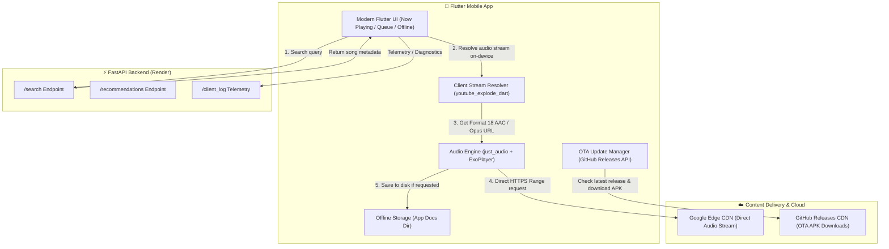

<div align="center">

# 🎵 Music App

### A High-Performance, Minimalist, Open-Source Music Streaming & Offline Audio App

[](https://flutter.dev)
[](https://dart.dev)
[](https://fastapi.tiangolo.com)
[](https://python.org)
[](https://opensource.org/licenses/MIT)
[](#)
[](https://github.com/charanteja-k/music_app/releases)

<p align="center">
  <b>Stream audio directly from edge CDNs with zero proxy lag, download songs offline, enjoy dynamic color theming, and auto-update effortlessly via GitHub Over-The-Air releases.</b>
</p>

[📥 Download Latest APK](https://github.com/charanteja-k/music_app/releases/latest) • [✨ Key Features](#-key-features) • [🏗️ Architecture](#️-architecture) • [🚀 Getting Started](#-getting-started) • [🤝 Contributing](#-contributing)

---

</div>

## 🌟 Highlights

- **⚡ Direct On-Device Streaming**: Audio streams are resolved natively on your device using residential/cellular IP. This completely eliminates datacenter bot blocks, server bandwidth bills, and proxy bottlenecks.
- **🎧 Lossless Quality & Progressive Playback**: Prioritizes **Format 18 progressive MP4 AAC** and **WebM Opus** containers, preventing DASH parser errors (`(0) Source error`) and delivering sub-second track start times.
- **📥 True Offline Downloads**: Save songs directly to local device storage and listen anywhere with zero internet connection.
- **🔄 In-App OTA Auto-Updates**: In-app self-updater powered by GitHub Releases. Users are notified in Settings and can download & update with a single tap.
- **🎨 Dynamic Palette Extraction**: The player UI automatically extracts vibrant and dominant accent colors from album artwork using `palette_generator`.
- **🌙 Bedtime Sleep Timer**: Set 15m, 30m, 45m, 60m timers or auto-stop playback at the end of the current song.
- **🔍 Fast Search & Recommendations**: Powered by a lightweight FastAPI backend deployed with automated health-checks and smart caching.

---

## 🏗️ Architecture



### Why On-Device Stream Resolution?
Most traditional YouTube audio wrappers stream all bytes through a centralized server:
$$\text{YouTube CDN} \xrightarrow{\quad\text{Bandwidth}\quad} \text{Backend Server} \xrightarrow{\quad\text{Latency}\quad} \text{Mobile App}$$
This causes two fatal issues:
1. **IP Rate-Limits & Bot Verification**: YouTube blocks traffic originating from datacenter IPs (AWS, Render, GCP, DigitalOcean).
2. **Server Costs & Stuttering**: Streaming 50MB audio files through a free/low-tier server leads to memory spikes and lag.

**Our Architecture**:
The backend server handles **only search and recommendations metadata** (mere kilobytes of JSON). The mobile phone resolves the stream using its own residential IP and streams audio **directly from Google's regional CDN**, achieving maximum speed, zero buffering, and infinite scalability!

---

## ✨ Key Features

| Feature | Description |
| :--- | :--- |
| **Instant Playback** | Sub-second audio playback using progressive MP4 (`ftypmp42`) AAC hardware decoding. |
| **Offline Library** | Download your favorite songs with metadata and artwork for offline listening. |
| **Live OTA Updater** | Check for updates directly inside the app settings; downloads and updates seamlessly. |
| **Adaptive UI** | Album-color adaptive gradient backgrounds and sleek dark mode theme. |
| **Search History** | Locally stored search queries with quick re-search and clearing options. |
| **Queue & Auto-Play** | Smart playlist queueing with silent background recommendation preloading. |
| **Sleep Timer** | Built-in countdown timer with auto-pause at track completion. |

---

## 📱 Screenshots & Previews

<div align="center">
  <i>(Add screenshots or mockups of your app screens here: Home, Search, Now Playing, and Settings)</i>
</div>

---

## 🚀 Getting Started

### Prerequisites
- **Flutter SDK**: `^3.12.0` or later ([Install Flutter](https://docs.flutter.dev/get-started/install))
- **Dart SDK**: `^3.0.0`
- **Android Studio** or **VS Code** with Flutter extensions
- **Python**: `3.11+` (for running the optional backend locally)

---

### 1. Clone the Repository

```bash
git clone https://github.com/charanteja-k/music_app.git
cd music_app
```

---

### 2. Run the Flutter Mobile App

1. Install Dart & Flutter dependencies:
   ```bash
   flutter pub get
   ```
2. Connect your Android device (or launch an emulator) and run:
   ```bash
   flutter run
   ```
3. To compile a production release APK:
   ```bash
   flutter build apk --release
   ```
   The generated APK will be at `build/app/outputs/flutter-apk/app-release.apk`.

---

### 3. (Optional) Run the Backend Locally

The mobile app connects by default to the deployed backend on Render. If you want to run your own backend locally:

```bash
cd backend
python3 -m venv venv
source venv/bin/activate
pip install -r requirements.txt
uvicorn main:app --reload --port 8000
```

Then update `lib/services/api_config.dart` with your local IP (`http://10.0.2.2:8000` for Android emulator or your local LAN IP for physical devices).

---

## 🤝 Contributing

We ❤️ open-source contributions! Whether you want to fix a bug, suggest a feature, improve documentation, or refine the UI design, you are warmly invited to contribute.

### How to Contribute:
1. **Fork the Repository**: Click the `Fork` button at the top right of this page.
2. **Create a Feature Branch**:
   ```bash
   git checkout -b feature/amazing-new-feature
   ```
3. **Commit your Changes**:
   ```bash
   git commit -m "feat: Add amazing new feature"
   ```
4. **Push to the Branch**:
   ```bash
   git push origin feature/amazing-new-feature
   ```
5. **Open a Pull Request**: Submit a PR with a clear summary of your changes.

### 🗺️ Planned Roadmap & Good First Issues:
- [ ] **Lock Screen Media Controls**: Full notification shade playback controls for Android 13+ with `MediaSession`.
- [ ] **Synchronized Lyrics**: Real-time karaoke-style lyrics display for currently playing tracks.
- [ ] **Custom Playlists**: Create, edit, and export personal playlists.
- [ ] **Equalizer**: Multi-band audio equalizer with preset sound profiles.
- [ ] **iOS TestFlight / IPA Provisioning**: Expand native iOS background playback & CarPlay support.

---

## 📜 License

This project is open source and available under the [MIT License](LICENSE).

---

## 💬 Acknowledgements & Credits

- [youtube_explode_dart](https://github.com/Hexer10/youtube_explode_dart) by Hexer10 for direct YouTube stream extraction.
- [just_audio](https://github.com/ryanheise/just_audio) by Ryan Heise for the audio playback library.
- [FastAPI](https://fastapi.tiangolo.com) for high-performance Python API routing.
- [yt-dlp](https://github.com/yt-dlp/yt-dlp) for YouTube metadata scraping.

---

<div align="center">
  Made with ❤️ by <a href="https://github.com/charanteja-k">Charan Teja Kondakalla</a> and open-source contributors.
</div>
